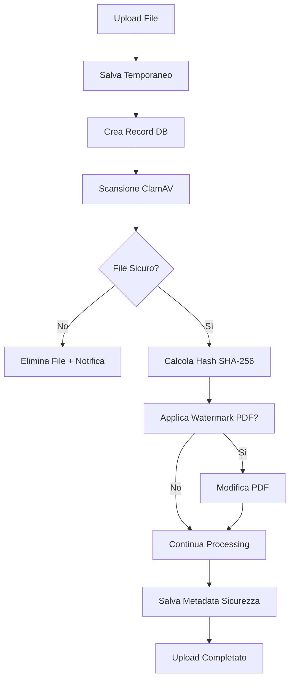
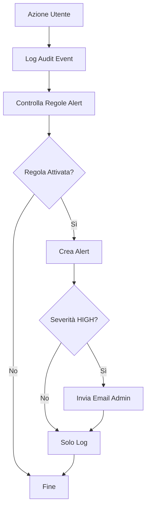

# 🛡️ Security Features - DOCS Project

## Panoramica

Il progetto DOCS è stato potenziato con funzionalità di sicurezza avanzate per garantire l'integrità, la sicurezza e il monitoraggio dei documenti. Questa documentazione descrive le nuove funzionalità implementate.

## 🦠 Integrazione ClamAV

### Descrizione
Ogni file caricato viene automaticamente scansionato con ClamAV per rilevare virus e malware.

### Funzionalità
- **Scansione automatica** all'upload di ogni file
- **Blocco upload** per file infetti
- **Salvataggio verdetti** in tabella `antivirus_scan`
- **Notifica utente** con messaggi chiari
- **Modalità strict/permissiva** configurabile

### Configurazione
```bash
# Variabili ambiente
CLAMAV_HOST=localhost          # Host ClamAV
CLAMAV_PORT=3310              # Porta ClamAV
STRICT_UPLOAD_SECURITY=False  # Modalità strict
```

### Installazione ClamAV
```bash
# Ubuntu/Debian
sudo apt install clamav clamav-daemon
sudo freshclam  # Aggiorna signature

# Docker
docker run -d --name clamav -p 3310:3310 mkodockx/docker-clamav
```

### Database
```sql
-- Tabella antivirus_scan
CREATE TABLE antivirus_scan (
    id INTEGER PRIMARY KEY,
    file_id INTEGER REFERENCES documents(id),
    engine VARCHAR(50),
    signature VARCHAR(100),
    verdict ENUM('clean', 'infected'),
    ts TIMESTAMP
);
```

## 🔐 Calcolo Hash SHA-256

### Descrizione
Calcolo automatico dell'hash SHA-256 per ogni file caricato per verificare l'integrità.

### Funzionalità
- **Calcolo automatico** hash SHA-256 all'upload
- **Salvataggio** in tabella `file_hash`
- **Verifica integrità** in fase di download
- **Rilevamento manomissioni** dei file

### Database
```sql
-- Tabella file_hash
CREATE TABLE file_hash (
    file_id INTEGER PRIMARY KEY REFERENCES documents(id),
    algo VARCHAR(10) DEFAULT 'SHA256',
    value VARCHAR(256),
    created_at TIMESTAMP
);
```

### API
```python
from services.antivirus_service import antivirus_service

# Calcolo hash
hash_value = antivirus_service.calculate_sha256('/path/to/file')

# Verifica integrità
is_safe, scan_result = antivirus_service.process_uploaded_file(file_path, file_id)
```

## 🖊️ Watermark PDF Dinamico

### Descrizione
Applicazione automatica di watermark personalizzati sui file PDF con informazioni utente e timestamp.

### Funzionalità
- **Watermark automatico** per file PDF confidenziali
- **Informazioni dinamiche**: nome utente, timestamp, IP
- **Classificazione**: applicato solo a file con `classification >= "Internal"`
- **Template personalizzabile** tramite variabili ambiente

### Configurazione
```bash
# Variabili ambiente
WATERMARK_ENABLED=True
WATERMARK_TEXT_TEMPLATE="User: {username} | {timestamp} | IP: {ip}"
```

### Criteri di Applicazione
Il watermark viene applicato quando:
- File è PDF (`.pdf`)
- Classification >= "Internal" OR flag `confidential=True` OR `visibility='privato'`

### Template Variables
- `{username}` - Nome utente
- `{full_name}` - Nome completo
- `{email}` - Email utente
- `{timestamp}` - Data e ora (dd/mm/yyyy hh:mm)
- `{ip}` - Indirizzo IP cliente
- `{document_title}` - Titolo documento
- `{company}` - Azienda
- `{department}` - Reparto

### API
```python
from services.watermark_service import watermark_service

# Controlla se watermark richiesto
if watermark_service.is_watermark_required(document, user):
    watermark_service.process_document_for_watermark(document, user, file_path)
```

## 🚨 Alert Comportamenti Anomali

### Descrizione
Sistema di monitoraggio e alert per rilevare comportamenti anomali degli utenti.

### Regole Implementate

#### 1. Burst Downloads
- **Descrizione**: Rileva download eccessivi in un breve periodo
- **Soglia**: `ALERT_BURST_THRESHOLD` download in `ALERT_BURST_WINDOW_MIN` minuti
- **Severità**: Medium
- **Default**: 10 download in 5 minuti

#### 2. Nuovo IP
- **Descrizione**: Rileva accesso da IP mai usato dall'utente
- **Periodo**: Controlla ultimi 90 giorni
- **Severità**: Low
- **Esclusioni**: IP 'unknown' ignorati

#### 3. Accesso Cross-Reparto
- **Descrizione**: Rileva accesso a documenti di reparto diverso
- **Severità**: High
- **Esclusioni**: Admin, documenti pubblici

### Configurazione
```bash
# Variabili ambiente
ALERT_BURST_THRESHOLD=10      # Soglia burst downloads
ALERT_BURST_WINDOW_MIN=5      # Finestra temporale minuti
```

### Database
```sql
-- Tabella security_alert
CREATE TABLE security_alert (
    id INTEGER PRIMARY KEY,
    ts TIMESTAMP,
    user_id INTEGER REFERENCES users(id),
    rule_id VARCHAR(50),
    severity ENUM('low', 'medium', 'high'),
    details TEXT,
    status ENUM('open', 'closed')
);
```

### API
```python
from services.alert_service import alert_service

# Controlla regole alert
triggered = alert_service.check_alert_rules(user_id, action, object_id)

# Ottieni alert aperti
alerts = alert_service.get_open_alerts(limit=50)

# Chiudi alert
alert_service.close_alert(alert_id, admin_user_id, note)
```

## 🎛️ UI Admin per Alert

### Descrizione
Interfaccia web completa per gestire gli alert di sicurezza.

### Funzionalità

#### Dashboard Alert (`/admin/alerts`)
- **Visualizzazione** alert con filtri
- **Filtri**: severità, stato, utente, paginazione
- **Statistiche**: contatori rapidi
- **Export CSV** con filtri applicati
- **Azioni**: visualizza dettagli, chiudi alert

#### Dettaglio Alert (`/admin/alerts/<id>`)
- **Informazioni complete** alert
- **Log correlati** (±1 ora dall'alert)
- **Profilo utente** coinvolto
- **Chiusura** con nota

#### Statistiche (`/admin/alerts/stats`)
- **Analisi periodo** configurabile (7/30/90/365 giorni)
- **Breakdown** per severità e regola
- **Tasso risoluzione** alert
- **Raccomandazioni** automatiche

### Routes
```python
@admin_bp.route('/admin/alerts')                    # Dashboard
@admin_bp.route('/admin/alerts/<int:id>')           # Dettaglio
@admin_bp.route('/admin/alerts/<int:id>/close')     # Chiusura
@admin_bp.route('/admin/alerts/export')             # Export CSV
@admin_bp.route('/admin/alerts/stats')              # Statistiche
```

### Navigazione
Aggiunto link "Security Alerts" nella sidebar admin con icona `fa-shield-alt`.

## 📧 Notifiche Email

### Descrizione
Invio automatico di email agli amministratori per alert critici.

### Criteri di Invio
- **Alert HIGH severity** generano email immediate
- **Destinatari**: utenti con ruolo `admin` o `superadmin`
- **Throttling**: evita duplicati negli ultimi 10 minuti

### Template Email
```
🚨 SECURITY ALERT DETECTED

📋 Alert Details:
- Rule ID: {rule_id}
- Severity: {severity}
- User: {username}
- Timestamp: {timestamp}

📄 Description:
{details}

🔗 Admin Panel: {base_url}/admin/alerts/{alert_id}
```

## 📊 Audit Logging

### Descrizione
Logging centralizzato di tutti gli eventi di sicurezza.

### Eventi Loggati
- **Upload bloccati** da antivirus
- **Watermark applicati** a PDF
- **Alert generati** e chiusi
- **Accessi file** (view/download)
- **Azioni admin** sui sistemi di sicurezza

### Database
```sql
-- Tabella security_audit_log
CREATE TABLE security_audit_log (
    id INTEGER PRIMARY KEY,
    ts TIMESTAMP,
    user_id INTEGER REFERENCES users(id),
    ip VARCHAR(45),
    action VARCHAR(100),
    object_type VARCHAR(50),
    object_id INTEGER,
    meta JSON,
    user_agent VARCHAR(255)
);
```

### Integrazione Automatica
Ogni chiamata a `log_audit_event()` attiva automaticamente il controllo delle regole di alert.

## 🏗️ Architettura

### Struttura File
```
/services/
├── antivirus_service.py    # Gestione ClamAV e hash
├── watermark_service.py    # Watermark PDF
└── alert_service.py        # Sistema alert

/utils/
└── audit_utils.py          # Logging audit

/templates/admin/
├── security_alerts.html    # Dashboard alert
├── alert_detail.html       # Dettaglio alert
└── alert_statistics.html   # Statistiche

/migrations/versions/
└── 001_add_security_tables.py  # Tabelle sicurezza
```

### Flusso Upload Sicuro


### Flusso Alert


## 🚀 Installazione e Setup

### 1. Dipendenze Python
```bash
pip install pyclamd PyPDF2 reportlab pikepdf flask-mail
```

### 2. Servizi Sistema
```bash
# ClamAV
sudo apt install clamav clamav-daemon
sudo systemctl start clamav-daemon
sudo freshclam
```

### 3. Database Migration
```bash
flask db upgrade  # Crea tabelle sicurezza
```

### 4. Configurazione
```bash
# Copia file configurazione
cp config/security.env.example .env.security
# Modifica valori secondo ambiente
nano .env.security
```

### 5. Test Configurazione
```python
# Test ClamAV
from services.antivirus_service import antivirus_service
print(antivirus_service._get_clamav_connection())

# Test Watermark
from services.watermark_service import watermark_service
print(watermark_service.check_pdf_libraries())

# Test Alert
from services.alert_service import alert_service
stats = alert_service.get_alert_statistics(days=7)
print(stats)
```

## 🔧 Monitoraggio e Manutenzione

### Log Monitoring
```bash
# Controlla log applicazione
tail -f app.log | grep -E "(security|alert|watermark|antivirus)"

# Alert aperti
psql -c "SELECT COUNT(*) FROM security_alert WHERE status='open';"

# Ultimo aggiornamento ClamAV
sudo freshclam --version
```

### Performance
- **ClamAV**: Può rallentare upload di file grandi
- **Watermark**: Modifica permanente dei PDF
- **Alert**: Controlli in background per ogni azione
- **Hash**: Calcolo SHA-256 per file grandi può richiedere tempo

### Backup
Assicurati di includere nelle routine di backup:
- Tabelle `security_alert`, `antivirus_scan`, `file_hash`, `security_audit_log`
- File di configurazione sicurezza
- Log di audit

## 🆘 Troubleshooting

### ClamAV non funziona
```bash
# Verifica servizio
sudo systemctl status clamav-daemon

# Verifica porta
netstat -ln | grep 3310

# Log ClamAV
sudo tail -f /var/log/clamav/clamav.log
```

### Watermark fallisce
```bash
# Verifica dipendenze
python -c "import PyPDF2, reportlab.pdfgen; print('OK')"

# Test file PDF
python -c "
from services.watermark_service import watermark_service
print(watermark_service.check_pdf_libraries())
"
```

### Alert non generati
```bash
# Verifica configurazione
python -c "
from services.alert_service import alert_service
print(f'Threshold: {alert_service.burst_threshold}')
print(f'Window: {alert_service.burst_window_minutes}')
"
```

### Email non inviate
```bash
# Verifica configurazione SMTP
flask shell
>>> from flask_mail import Message
>>> from app import mail
>>> msg = Message('Test', recipients=['admin@example.com'])
>>> mail.send(msg)
```

## 📝 Note di Sicurezza

1. **ClamAV Signatures**: Aggiorna regolarmente con `freshclam`
2. **PDF Watermark**: Modifica permanente, testa prima in ambiente di sviluppo
3. **Alert Email**: Evita spam configurando correttamente le soglie
4. **Hash Verification**: Monitora per rilevare manomissioni file
5. **Admin Access**: Limita accesso agli alert solo ad amministratori autorizzati

## 🔗 Link Utili

- [ClamAV Documentation](https://www.clamav.net/documents)
- [PyPDF2 Documentation](https://pypdf2.readthedocs.io/)
- [Flask-Mail Documentation](https://flask-mail.readthedocs.io/)
- [Bootstrap 5 Components](https://getbootstrap.com/docs/5.0/components/)

---

**Implementato per progetto DOCS (IP: 138.68.80.169)**  
**Data: Gennaio 2025**  
**Versione: 1.0**
